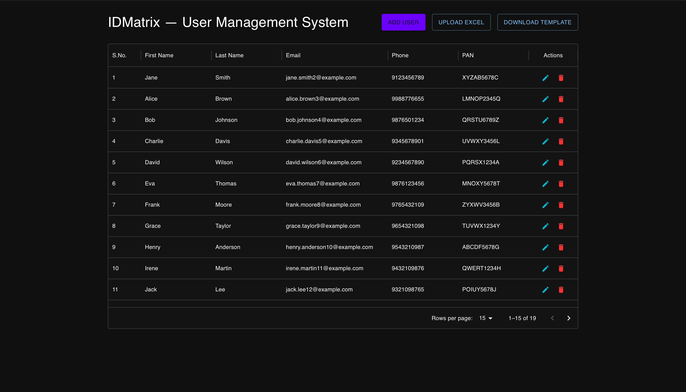
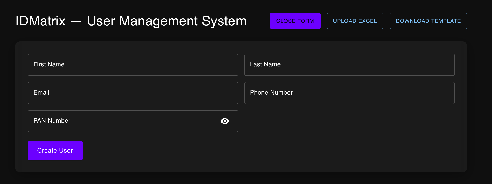
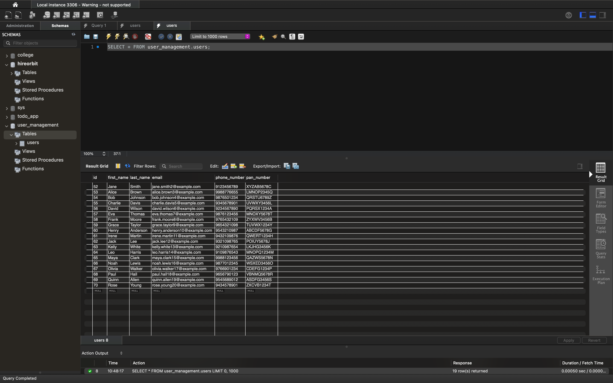

# IDmatrix — User Management App

##  Overview
This is a full-stack user management app with:
- Create, update, delete users
- Bulk upload users via Excel
- Downloadable template
- Validations and clear error feedback

---

## ⚙ Technologies Used

- **Frontend**: React (Vite), TypeScript, MUI
- **Backend**: Python, FastAPI, Pydantic, Pandas
- **Database**: MySQL

---
## Screenshots

### 🏠 Home Dashboard


### ➕ Add User Form


### 🗃️ SQL Database (Example)


##  How to Run Locally

### 1️⃣ Clone the repository
```bash
git clone https://github.com/SONISOMYA/idmatrix.git
cd idmatrix
```
2️⃣ Setup backend
```bash
cd backend
python -m venv venv
source venv/bin/activate  # or venv\Scripts\activate on Windows
pip install -r requirements.txt
uvicorn main:app --reload
```
3️⃣ Setup frontend
```bash
cd frontend
npm install
npm run dev
```
4️⃣Setup Database
1.	Open MySQL:
   ``` bash
mysql -u root -p

```
2.	Run the schema:

``` bash
SOURCE backend/schema.sql;
```


## Assumptions & Known Issues
	•	Uses MySQL for Db.
	•	PAN format must match AAAAA9999A.
	•	Phone number must be 10 digits.


